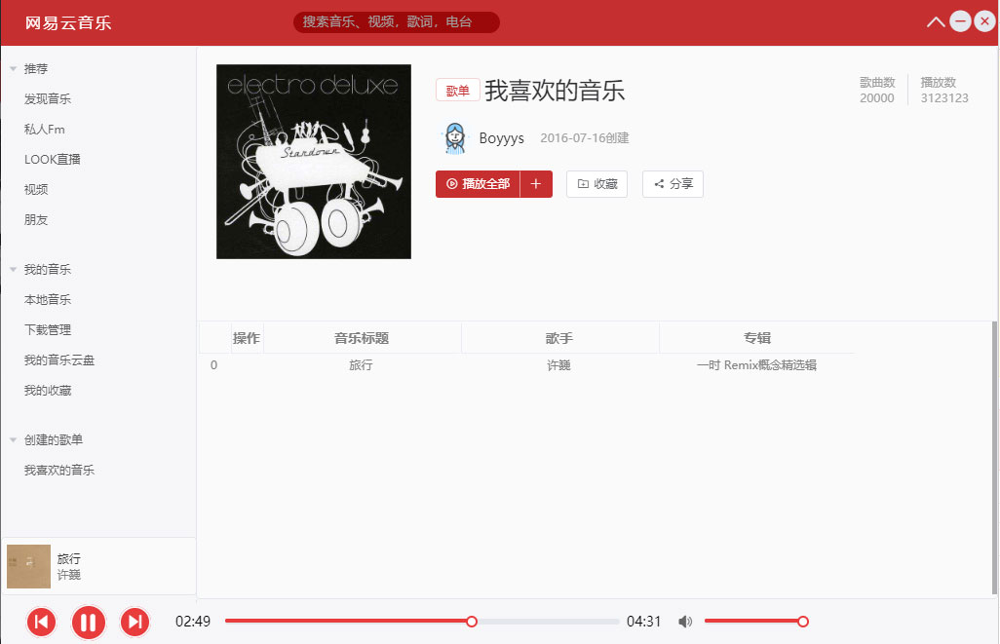

# Element-Music-Player

基于Electron + Vue + ElementUI打造的客户端，主要仿造网易云PC端，本地文件方面利用Node端读取文件流推送给Render端完成音乐播放功能。 

技术支持：https://github.com/whxaxes/boom

#### 安装与运行
``` bash
# install dependencies
npm install
# serve with hot reload at localhost:9080
npm run dev
# build electron application for production
npm run build
# run unit & end-to-end tests
npm test
# lint all JS/Vue component files in `src/`
npm run lint
```

### Todolist

1. 支持本地音乐文件播放。✔
2. 歌词功能。✔
3. 调用网易云API支持在线音乐播放。❌
4. 定制歌单收藏在线和本地音乐。❌
5. 各种播放模式(随机、循环)。❌

#### 暂时成果

##### 首页



##### 热搜栏


##### 歌词显示


